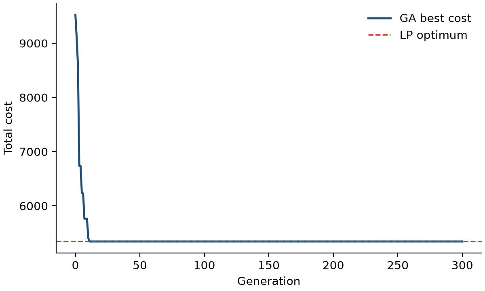
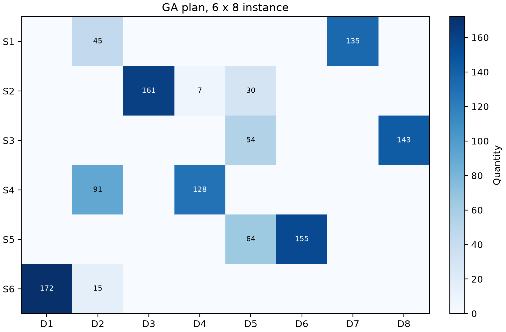

# tp-ga — modelling and optimisation of the transportation problem with genetic algorithms

[](https://github.com/Almasmm/tp-ga/actions/workflows/ci.yml)
[](https://github.com/Almasmm/tp-ga/actions/workflows/release.yml)
[](LICENSE)


The code base of the master's research project *Modelling and optimisation of the transportation problem using
genetic algorithms* (Astana IT University). It contains the `tpga` Python library and, as it grows, the web
platform built on it. The library solves the classical transportation
problem with a **permutation-encoded genetic algorithm** whose individuals are turned into shipment plans by a
**greedy decoder**, and reports every GA result against the **exact linear-programming optimum**.

## Problem

Minimise $Z = \sum_i \sum_j c_{ij} x_{ij}$ subject to $\sum_j x_{ij} = a_i$, $\sum_i x_{ij} = b_j$, $x_{ij} \ge 0$.

A chromosome is a permutation of the $m \cdot n$ arcs. The decoder visits the arcs in that order and assigns
$x_{ij} = \min(a_i^{(r)}, b_j^{(r)})$, the smaller of the remaining supply and demand. For a balanced problem
with a complete arc set every chromosome therefore decodes to a feasible plan, and no penalty or repair is needed.
The guarantee does **not** extend to arc capacities, fixed charges or time windows, and says nothing about optimality.
Because exact methods solve the classical model directly, `tpga` always computes the LP optimum as a reference.

## Installation

```bash
git clone https://github.com/Almasmm/tp-ga.git
cd tp-ga
pip install -e .            # library and CLI
pip install -e .[dev]       # plus pytest, ruff, mypy, build
```

## Usage

Command line:

```bash
tpga generate instance.json -m 6 -n 8 --seed 42
tpga solve examples/small_3x3.json --seed 0
tpga solve examples/random_6x8.json --method both --seed 0 --plot conv.png --plan-plot plan.png --json
```

```text
instance: 3 sources x 3 destinations, balanced=True
LP optimum: 225.0000
GA best:    225.0000  (gap 0.00%, 12060 evaluations, 0.41s)
```

Python API:

```python
from tpga import TransportProblem, GAConfig, run_ga, solve_lp

p = TransportProblem(supply=[20, 30, 20], demand=[25, 25, 20], cost=[[8, 6, 3], [5, 4, 9], [2, 7, 6]])
x_lp, z_lp = solve_lp(p)  # exact optimum: 225
r = run_ga(p, GAConfig(population=60, generations=200, seed=0))
print(r.cost, r.evaluations, p.is_feasible(r.x))
```

Unbalanced instances are balanced automatically with a zero-cost dummy source or destination.

| Convergence on `examples/random_6x8.json` | Best plan |
|---|---|
|  |  |

One run with seed 0 (population 80, 300 generations): GA cost 5342, LP optimum 5342.
This illustrates the tool; it is not a benchmark, and a single run says nothing about average behaviour.

## Project structure

```text
src/tpga/        model.py  decoder.py  ga.py  exact.py  plot.py  cli.py
tests/           unit, property-style and CLI tests (pytest)
examples/        JSON instances
.github/         CI and release workflows, Dependabot, issue and PR templates
```

## Technology choices

| Need | Choice | Why |
|---|---|---|
| Language | **Python 3.10+** | Standard in scientific computing; the numerical stack below is mature; readable for reviewers of the research. |
| Arrays | **NumPy** | Vectorised plan and cost arithmetic; reproducible random streams via `numpy.random.Generator`. |
| Exact baseline | **SciPy `linprog` (HiGHS)** | Open-source, state-of-the-art LP solver shipped with SciPy, so no extra dependency or licence. |
| Plots | **matplotlib** | De-facto standard for publication figures; works headless in CI (`Agg` backend). |
| Tests | **pytest** (+ pytest-cov) | Concise fixtures and parametrisation; coverage gate of 90 % in CI. |
| Style / lint | **ruff** | One fast tool for linting, import sorting and formatting. |
| Types | **mypy** | Catches interface errors in numerical code before runtime. |
| Packaging | **pyproject.toml + setuptools** | PEP 621 standard metadata; `pip install -e .` and a `tpga` console script. |
| VCS / hosting | **Git + GitHub** | Issues, pull requests, branch protection and Actions in one place. |
| CI/CD | **GitHub Actions** | Native to GitHub; free for public repositories; matrix builds on Linux and Windows. |

## Quality checks and CI/CD

- [`ci.yml`](.github/workflows/ci.yml) — on every push and pull request: ruff lint and format check, mypy, then the
  test suite on **Ubuntu and Windows × Python 3.10, 3.11, 3.12** with a 90 % coverage gate, then a package build
  whose wheel is installed in a clean environment and smoke-tested with the CLI.
- [`release.yml`](.github/workflows/release.yml) — on a tag `vX.Y.Z`: runs the tests, checks that the tag equals the
  package version, builds the sdist and wheel and publishes them as a **GitHub Release** (continuous delivery).
- [`dependabot.yml`](.github/dependabot.yml) — monthly update pull requests for actions and Python dependencies.
- `main` is protected: changes arrive through pull requests that must pass CI.

Run the same checks locally:

```bash
ruff check . && ruff format --check . && mypy && pytest --cov=tpga
```

## Contributing, citation, licence

See [CONTRIBUTING.md](CONTRIBUTING.md) and [CHANGELOG.md](CHANGELOG.md). Citation metadata is in
[CITATION.cff](CITATION.cff). Released under the [MIT licence](LICENSE).

Author: Almas Murat, Astana IT University. ORCID [0009-0008-6202-088X](https://orcid.org/0009-0008-6202-088X).
